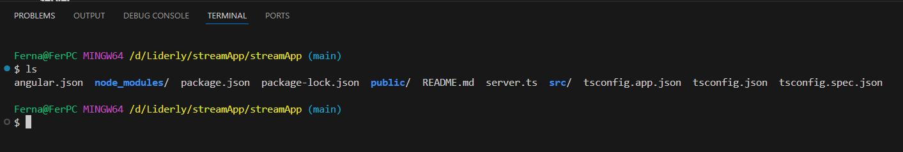
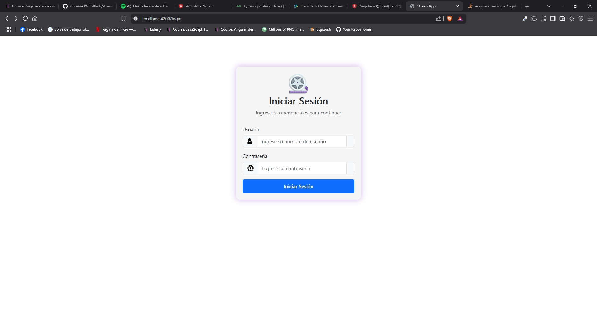
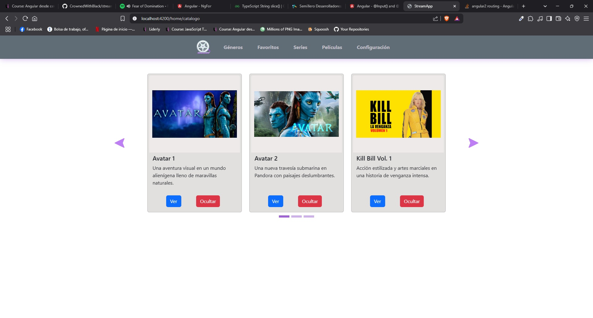
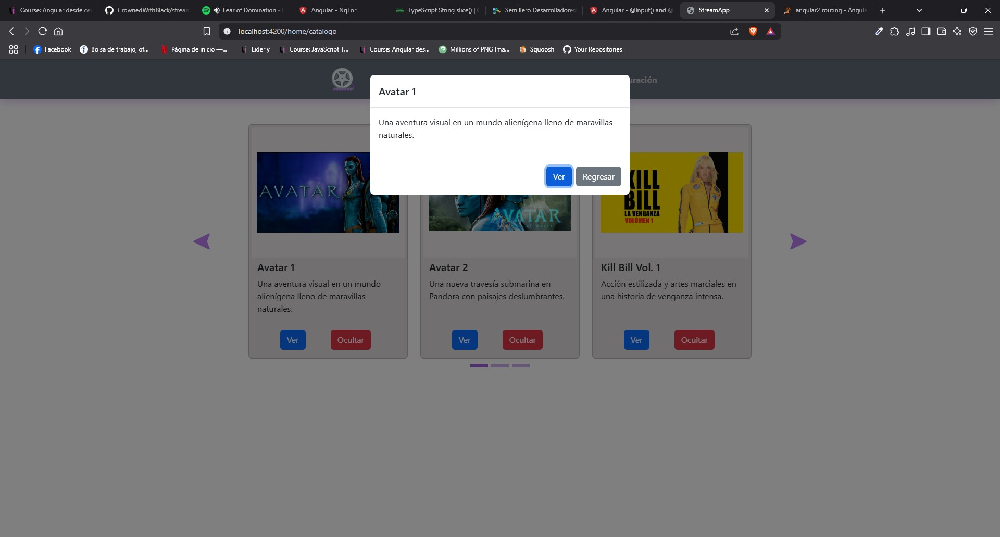

# StreamApp

## Descripción
Este proyecto esá pensado para ser una plataforma web de streaming, de momento solo cuenta con pocos elementos, la mayoría de placeholder.
En este segundo sprint procuré arreglar la deuda tecnica que dejé en el anterior sprint, la mayor parte del contenido se genera de forma automatica e intenté crear componentes y servicios reutilizables para reducir el boilerplate.

## Instalación / Como usar
- Descargar el repositorio directo desde GitHub: https://github.com/CrownedWithBlack/streamApp.git
- Clona el repositorio: `gh repo clone CrownedWithBlack/streamApp`

Una vez tengas los archivos en tu equipo, abre tu IDE, se recomienda usar VSCode. Una vez en vscode abre la terminal y navega hasta la ruta raíz del proyecto, para asegurarte que estés en la raíz usa el comando `ls` en la terminal, deberías ver algo como esto:

Ahora usa el comando `npm install`, si no tienes instalado node/npm, lo puedes encontrar aquí: https://nodejs.org/es

Esto instalará los archivos necesarios para el proyecto, una vez que termine, vuelve a la terminal y escribe el comando `ng serve`. En la terminal se mostrara una dirección de localhost haz `ctrl + click` para abrir el enlace y se muestre el proyecto.

## Capturas
### Login

### Catálogo

### Detale

## Dependencias / Bibliotecas
 - Angular 18.2.18
 - Bootstrap 5.3.5
 - ng-Bootstrap 17.0.1

## ¿Cómo lo hice?
Mi enfoque principal fue en hacerlo lo más modular y escalable posible, esto para reducir la carga de trabajo en futuros sprints. Esto lo logre por medio de algunos componentes compartidos los cuales se encuentran en la carpeta de **shared**. Además de eso, opté por crear un layout de rutas para ayudar a la reutilización de componentes, un ejemplo es el **nav bar**, y la ruta **home**:

`<app-nav-bar></app-nav-bar>
<router-outlet></router-outlet>
`

## Problemas conocidos
La gran parte de los problemas que encontré son errores visuales con el carrusel de bootstrap, ya que los elementos no se muestran como
deberían al cambiar el tamaño de la pantalla, invertí bastante tiempo en intentar arreglar todos los problemas pero no pude con todos, aun así
aprendí muchisímo

## Retrospectiva
### ¿Qué hice bien?
Honestamente, creí que el resultado sería mucho peor por lo que diría que lo hice bien de manera general. Si tuviera que elegir algo en específico
diría que el CSS, no es el más bonito del mundo pero tengo nula experiencia con CSS y el resultado es bastante aceptable.
### ¿Qué no salió bien?
Lo que más me disgustó fue que el carrusel del catalógo no quedo responsive al 100%, diría que es el mayor defecto.
### ¿Qué puedo hacer diferente?
Todo. Mi plan es intentar rehacer tanto back como front, ya que ahora tengo identificadas todas las áreas de oportunidad, además de que al momento
de escribir esto cuento con mejores habilidades que cuando comencé. Principalmente me enfocaré en añadir elementos HMTL con JS.
Además, ya podré dedicar más tiempo al proyecto ya que hice espacio en mi agenda para ahora si meterme de lleno full time a esto :grin:.