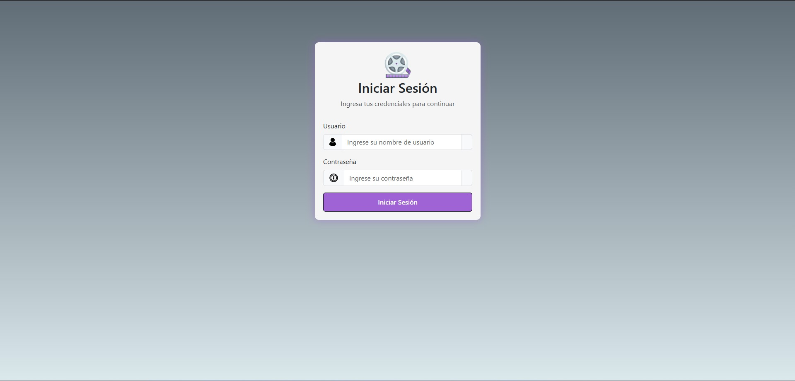
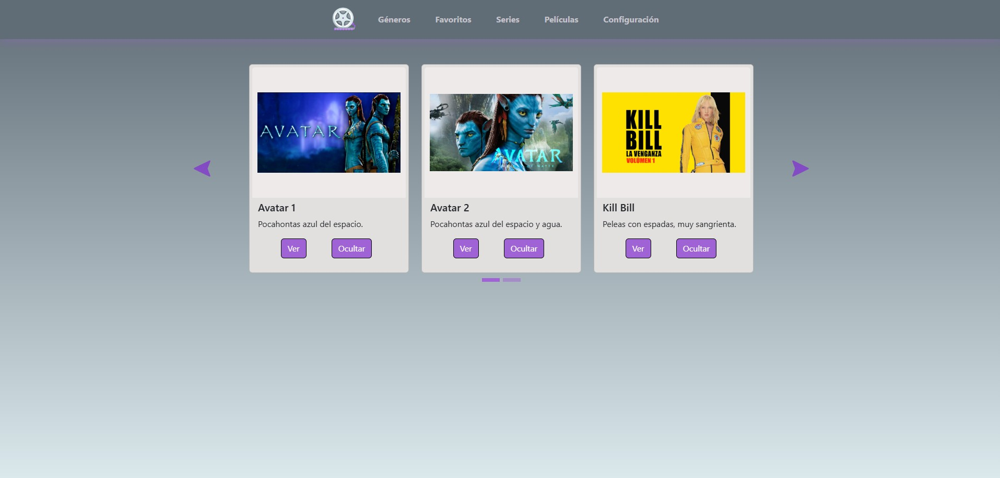
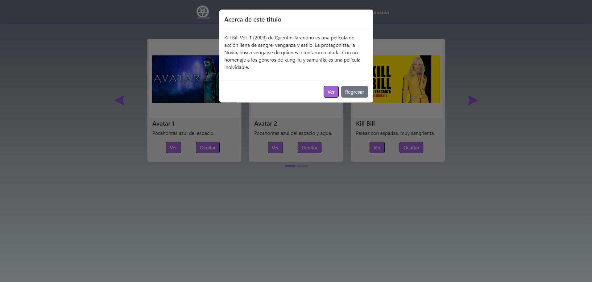
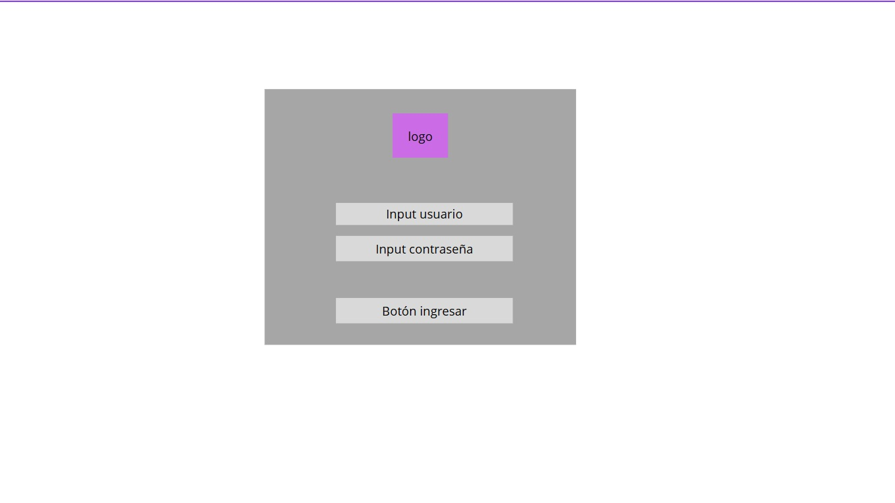
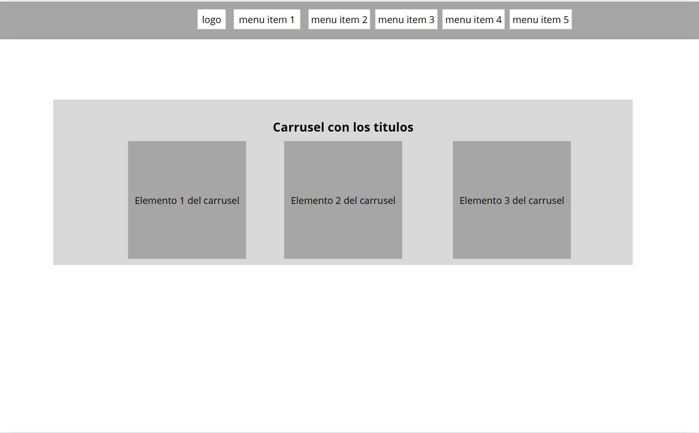

# StreamApp

## Descripción
Este proyecto esá pensado para ser una plataforma web de streaming, de momento solo cuenta con elementos básicos
de front end y unas cuantas funcionalidades de back con javaScript. La mayor parte del contenido actual son placeholders
mismos que se iran actualizando por contenido más apropiado.

## Instalación / Como usar
- Descargar el repositorio directo desde GitHub: https://github.com/CrownedWithBlack/streamApp.git
- Clona el repositorio: `gh repo clone CrownedWithBlack/streamApp`

Una vez tengas los archivos se recomienda abrir el proyecto con Visual studio code y visualizar el proyecto con la extensión
de Live server.
- Obtén Live server aquí: https://marketplace.visualstudio.com/items/?itemName=ritwickdey.LiveServer

## Capturas
### Login

### Catálogo

### Detale

## Mockup
### Login

### Catalogo

## ¿Cómo lo hice?
Antes que nada cabe mencionar que tengo muy poca experiencia con programación web, a pesar de eso ha sido muy divertido.

Inicialmente comencé a desarrollar el front usando solo HTML y CSS, pero después opté por usar bootstrap, ya que
nunca lo había usado y esta es una buena oportunidad, al no tener experiencia inicié copiando las plantillas que te ofrecen
en la documentación de bootstrap. Conforme fueron pasando los días y comencé a tomar experiencia cada vez consultaba menos la documentación.
Nunca he sido muy fan del front-end, pero creo que comienza a agradarme ahora que me metí de lleno.

Ahora, respecto al back; nunca había usado javaScript mi lenguaje más fuerte es Java y al principio me costó mucho trabajo acostumbrarme
a esta nueva sintaxis, en especial con los callback, ya que estoy muy acostumbrado a siempre agregar los paréntesis cuando paso una función
como parámetro :laughing:. Pero siento que ya le agarré la onda a JS y ahora estoy muy emocionado por lo que se viene.

Respecto a temas técnicos, el front está muy hardcodeado, a mitad del desarrollo pensé en agregar elementos de manera automática con JS, pero
como quiero agarrar más expertise en front me decidí a continuar haciéndolo a mano, obviamente más adelante lo haré como se debe.

## Problemas conocidos
La gran parte de los problemas que encontré son errores visuales con el carrusel de bootstrap, ya que los elementos no se muestran como
deberían al cambiar el tamaño de la pantalla, invertí bastante tiempo en intentar arreglar todos los problemas pero no pude con todos, aun así
aprendí muchisímo

## Retrospectiva
### ¿Qué hice bien?
Honestamente, creí que el resultado sería mucho peor por lo que diría que lo hice bien de manera general. Si tuviera que elegir algo en específico
diría que el CSS, no es el más bonito del mundo pero tengo nula experiencia con CSS y el resultado es bastante aceptable.
### ¿Qué no salió bien?
Lo que más me disgustó fue que el carrusel del catalógo no quedo responsive al 100%, diría que es el mayor defecto.
### ¿Qué puedo hacer diferente?
Todo. Mi plan es intentar rehacer tanto back como front, ya que ahora tengo identificadas todas las áreas de oportunidad, además de que al momento
de escribir esto cuento con mejores habilidades que cuando comencé. Principalmente me enfocaré en añadir elementos HMTL con JS.
Además, ya podré dedicar más tiempo al proyecto ya que hice espacio en mi agenda para ahora si meterme de lleno full time a esto :grin:.