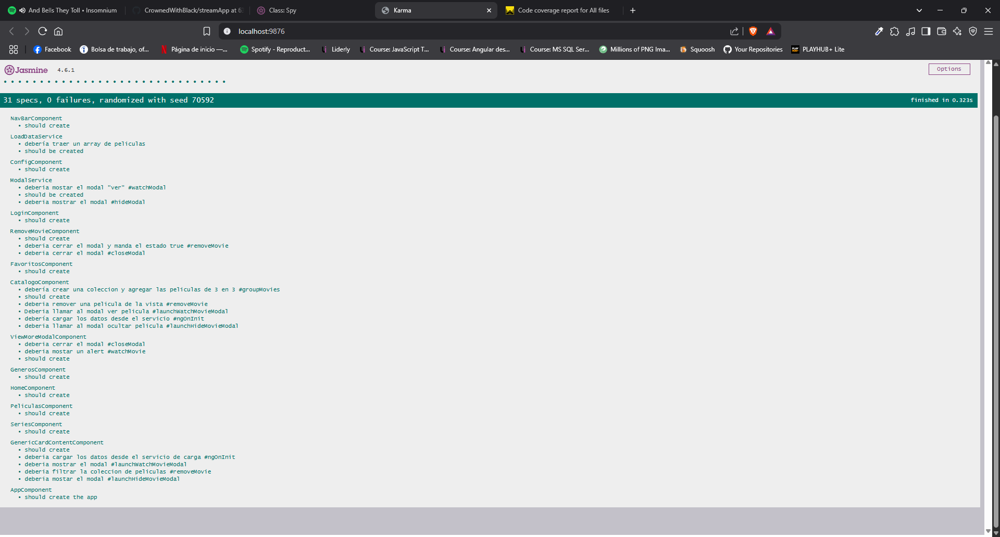
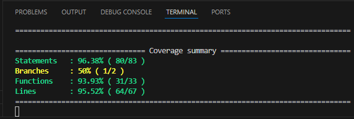

# StreamApp

## Descripción
Este proyecto esá pensado para ser una plataforma web de streaming, de momento solo cuenta con pocos elementos, la mayoría de placeholder.
En este segundo sprint procuré arreglar la deuda tecnica que dejé en el anterior sprint, la mayor parte del contenido se genera de forma automatica e intenté crear componentes y servicios reutilizables para reducir el boilerplate.

## Obejtivo
- A corto plazo: migrar el proyecto anterior de JS vanilla a Angular.
- A largo plazo: crear una aplicación web de streaming 100% funcional.

## Instalación / Como usar
- Descargar el repositorio directo desde GitHub: https://github.com/CrownedWithBlack/streamApp.git
- Clona el repositorio: `git clone https://github.com/CrownedWithBlack/streamApp.git`

Una vez tengas los archivos en tu equipo, abre tu IDE, se recomienda usar VSCode. Una vez en vscode abre la terminal y navega hasta la ruta raíz del proyecto, para asegurarte que estés en la raíz usa el comando `ls` en la terminal, deberías ver algo como esto:

Ahora usa el comando `npm install`, si no tienes instalado node/npm, lo puedes encontrar aquí: https://nodejs.org/es

Esto instalará los archivos necesarios para el proyecto, una vez que termine, vuelve a la terminal y escribe el comando `npm run testcc` para ejecutar el script de tests con code coverage o ejecuta el comando `ng test` para ejecutar las pruebas sin code coverage.

Para leer el reporte de code coverage ve al file explorer de VsCode a la ruta:
**coverage\stream-app\index.html**. Haz click drecho sobre el archivo **index.html** y después en Open with Live Server.

## Capturas
### Code coverage Istanbul reporter

### Code coverage Karma report

### Code coverage terminal

### Login

### Catálogo

## Dependencias / Bibliotecas
- Node.js 22.14.0 LTS
 - Angular 18.2.18
 - Bootstrap 5.3.5
 - ng-Bootstrap 17.0.1

## ¿Cómo lo hice?
Antes de comenzar a escribir las pruebas decidí eliminar el código repetitivo para reducir la carga de trabajo, además de que se veía feo con las mismas lineas repetidas en varios componentes, aquí una muestra de cuantas lineas se eliminaron:

Esto lo logré creando un **componente compartido** llamado `generic-card-content`. Este componente tiene la misma estructura que los componentes de **series, peliculas, favortios, etc..**. Entonces dentro de esos componetes, en su **template html** correspondiente solamente llamo a la directiva `<app-generic-card-content>` y le paso el titulo correspondiente por medio de **@Input**, quedando así: `<app-generic-card-content [pageTitle]="'tituloCorrespdiente'">`.

También agregué estilos CSS globales en el **styles.css** en el directorio raíz, anterioremente lo había intentado pero no funcionaban, me di cuenta que como había instalado bootstrap y agregado la dependecia del **node_modules** en el ***angular.json*** entraba en conflicto, por lo que eliminé la dependecia y dejando el `@import 'bootstrap/scss/bootstrap'` dentro del **styles.css** :sweat_smile:.

Respecto a las pruebas me enfoqué en testear todas las funciones del proyecto, dandole prioridad a los servicios y componentes compartidos, ya que estos son críticos para el proyecto. Para mayores detalles técnicos especificos la gran mayoría del código está comentado, exceptuando el boilerplate y uno que otro array que funge como mock de datos.

## Problemas conocidos
En este sprint no toqué nada que mejorara o empeorara la aplicación ya que fue puro testing, exceptuando la pequeña optimización que hice, por lo que los problemas conocidos son los mismos de la versión anterior; bugs visuales de responsividad.

## Retrospectiva
### ¿Qué hice bien?
La reutilización de componentes quedó muy bien ya que el código se redujo en 247 lineas. También el code coverage quedó en muy buen porcentaje quedando en un **96.38%** para los statements y en un **95.52%** para las lineas. Me hubiera gustado alcanzar un 100% pero si está difícil :sweat_smile:.
### ¿Qué no salió bien?
En general todo se me dificultó ya que nunca había usado angular, ahora si le sumamos aprender jasmine, que es el "framework del framework :dizzy_face:". Mi mayor dolor de cabeza siguen siendo los componentes de ngBootsrtrap, pero paso a paso ahí vamos. También hubo un statement que simplemente no pude cubrir el cual estaba dentro de una función con callback.
### ¿Qué puedo hacer diferente?
Ya me decidí a eliminar el carrusel de bootstrap que tengo en el componente de catalogo ya que siento que no es muy apropiado para el tipo de app que es, me di cuenta de esto visitando algunas páginas de peliculas piratas jejeje. Tengo pensando en sustiuirlo con una vista "clásica" de cards como las que manejo en los otros componentes, pero la diferencia sería en tratar de implementar un efecto similar al **"endless scrolling"**, ya que al ser el catalogo principal, en teoría debe mostrar todo el contenido disponible y el carrusel no es apto para desplegar tal cantidad de contenido.